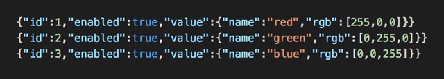

# vscode-ndjson
> Vscode extension to support [NDJSON (newline delimited Json)](http://ndjson.org/) files

[](https://marketplace.visualstudio.com/items?itemName=adrieankhisbe.vscode-ndjson)
[](https://travis-ci.com/AdrieanKhisbe/vscode-ndjson)

This was forked from [NDJSON Colorizer](https://marketplace.visualstudio.com/items?itemName=buster.ndjson-colorizer)

## With :)



## Without :(


## Configuration

* By default only `*.ndjson` files are colorized.
* You can update your settings file(s) as needed, using `"files.associations"`:

```json
{
  // ...

  "files.associations": {
    "*.db": "ndjson",
    "*.jsonl": "ndjson",
    "*.njson": "ndjson"
  }
}
```
