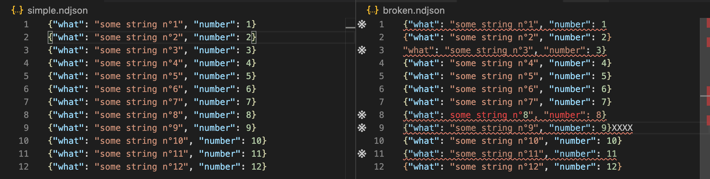

# vscode-ndjson
> Vscode extension to support [NDJSON (newline delimited Json)](http://ndjson.org/) files

[](https://marketplace.visualstudio.com/items?itemName=adrieankhisbe.vscode-ndjson)
[](https://travis-ci.com/AdrieanKhisbe/vscode-ndjson)

## About

This was forked from [NDJSON Colorizer](https://marketplace.visualstudio.com/items?itemName=buster.ndjson-colorizer),
initially to add the content of the [Grammar refactor and Language Diagnostic PR n°1 **Pull request**](https://github.com/busterc/vscode-ndjson-colorizer/pull/1)

Internaly it **reuse json grammar** and add some **language support for JSON**, syntax errors being notably displayed in the gutter.

## NDJSON support Preview



## Configuration

* By default only `*.ndjson` files are colorized.
* You can update your settings file(s) as needed, using `"files.associations"`:

```json
{
  // ...

  "files.associations": {
    "*.db": "ndjson",
    "*.jsonl": "ndjson",
    "*.njson": "ndjson"
  }
}
```
